# Welcome to the Front-end Online Store project repository!

### README Translations:

-   [English](/README.en.md)
-   [Portuguese](/README.md)

* * *

## 👨‍💻 What was developed:

-   In this project we developed a simplified version, without database persistence, of an online store, developing its functionalities in a group according to demands defined in a Kanban board, in a scenario close to the job market.
-   From these demands, we have an application in which users can:
    -   Search for products by terms and categories from the Mercado Livre API;
    -   Interact with the searched products in order to add and remove them from a shopping cart in different quantities;
    -   View details and previous reviews of a product, as well as create new reviews and;
    -   Simulate checkout for selected items.

:bulb:**See a sample below:**


## Skills used:

-   Understand what Agile Methods are;
-   Understand what Kanban is;
-   Understand what Scrum is;
-   Work in teams using Kanban or Scrum effectively;
-   Practice all skills developed so far in the Front-end module.

# requirements

## 1. Implement the Mercado Livre API access module

**PRIORITY 0**

<details>
<summary>Implemente um módulo que acessa a API do Mercado Livre:</summary>

-   Utilize (**MANDATORY**) the file`src/services/api.js`to access the Mercado Livre API in your application;
-   Utilize (**MANDATORY**) the module**[Fetch](https://developer.mozilla.org/en-US/docs/Web/API/Fetch_API/Using_Fetch)**to carry out requests;
-   <details><summary>Você deve (<b>OBRIGATORIAMENTE</b>) implementar as funções <code>getCategories()</code> e <code>getProductsFromCategoryAndQuery()</code> que estão no arquivo <code>src/services/api.js</code>:</summary>

    ```javascript
    export async function getCategories() {
      // Implemente aqui
    }

    export async function getProductsFromCategoryAndQuery(/* categoryId, query */) {
      // Implemente aqui! Quando o fizer, descomente os parâmetros que essa função recebe
      // Essa função será chamada em vários momentos do projeto para buscar os produtos pela categoria e querys
      // Dentro da função você pode usar condicionais definir qual API utilizar
    }
    ```

    These functions must make a call to the[Free Market API](#-Documentação-da-API-do-Mercado-Livre)and return a[Promise](https://developer.mozilla.org/en-US/docs/Web/JavaScript/Reference/Global_Objects/Promise)with the result data. With this implementation, the use of these functions should look something like the example below:

    ```javascript
    import * as api from './services/api'

    api.getCategories().then(categories => { console.log(categories) })
    ```

    The variable`categories`must contain the JSON object with the categories obtained through the Mercado Livre API call:

    ```json
    [
      {
          "id": "MLB5672",
          "name": "Acessórios para Veículos"
      },
      {
          "id": "MLB271599",
          "name": "Agro"
      },
      {
          "id": "MLB1403",
          "name": "Alimentos e Bebidas"
      }
    ]
    ```

    </details>
-   Feel free to create new functions in this file, but only the functions<code>getCategories()</code>e<code>getProductsFromCategoryAndQuery()</code>will be evaluated.
    </details><br />

<details>
  <summary><strong>O que será verificado</strong></summary>

-   Implement the function`getCategories`;
-   Implement the function`getProductsFromCategoryAndQuery`.
    </details>

* * *

## 2. Create an empty product listing page

**PRIORITY 0**

The main screen of the platform is**product listing**, where the user can search for products to add to the cart, in addition to filtering their searches.

<details><summary>Crie o campo de busca da tela principal, que será utilizado para listar os produtos encontrados:</summary>

-   This page must be in the path`/`, renderable from component access`<App />`;
-   Initially the product listing must be empty;
-   When the list is empty, the page should show the message`"Digite algum termo de pesquisa ou escolha uma categoria."`;
-   add the attribute`data-testid`with the value`home-initial-message`in the message element.
    </details>

<details><summary><b>Exemplo de página de listagem de produtos antes da busca</b></summary>
  
  A imagem pode ser acessada no arquivo `./wireframes/card_02.png`

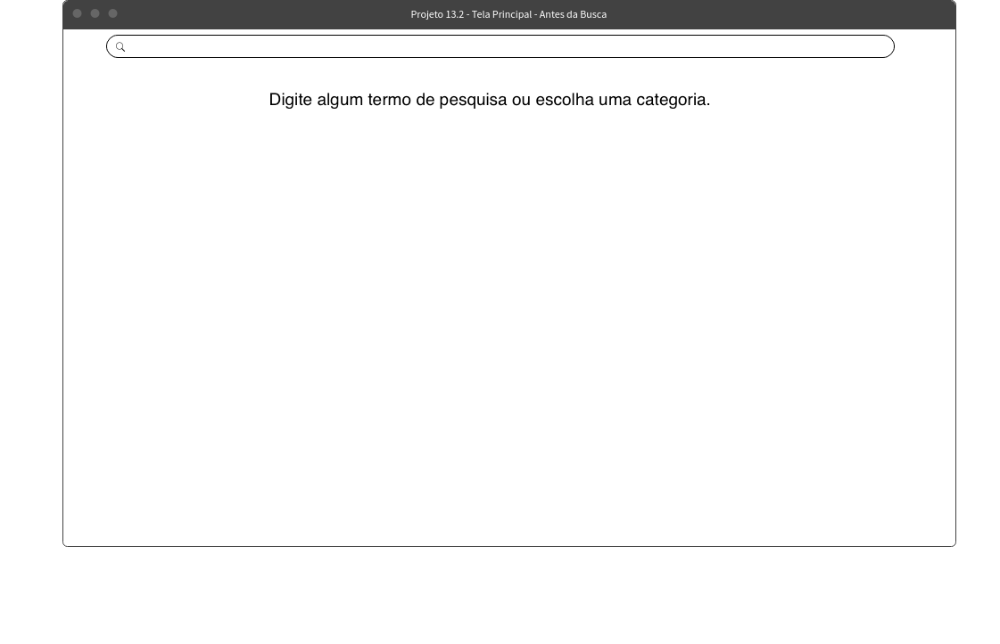

</details><br />

<details>
  <summary><strong>O que será verificado</strong></summary>

-   The root of the application, in`<App />`, renders successfully;
-   The screen contains the requested message: 'Enter a search term or choose a category.'.
    </details>

* * *

## 3. Create the shopping cart page

**PRIORITY 1**

The user will be able to add products to their shopping cart, from the list of products.

Create a screen that will represent the application's shopping cart. Also, on the main screen, create a button that redirects to the shopping cart page. Initially, the cart must be empty.

<details><summary> Crie uma tela que represente o carrinho de compras:</summary>

-   When there are no products in the shopping cart, the page should display the message`"Seu carrinho está vazio"`;
-   add the attribute`data-testid`with the value`shopping-cart-empty-message`in the message element.

      <details><summary><b>Exemplo da tela Carrinho de Compras</b></summary>

        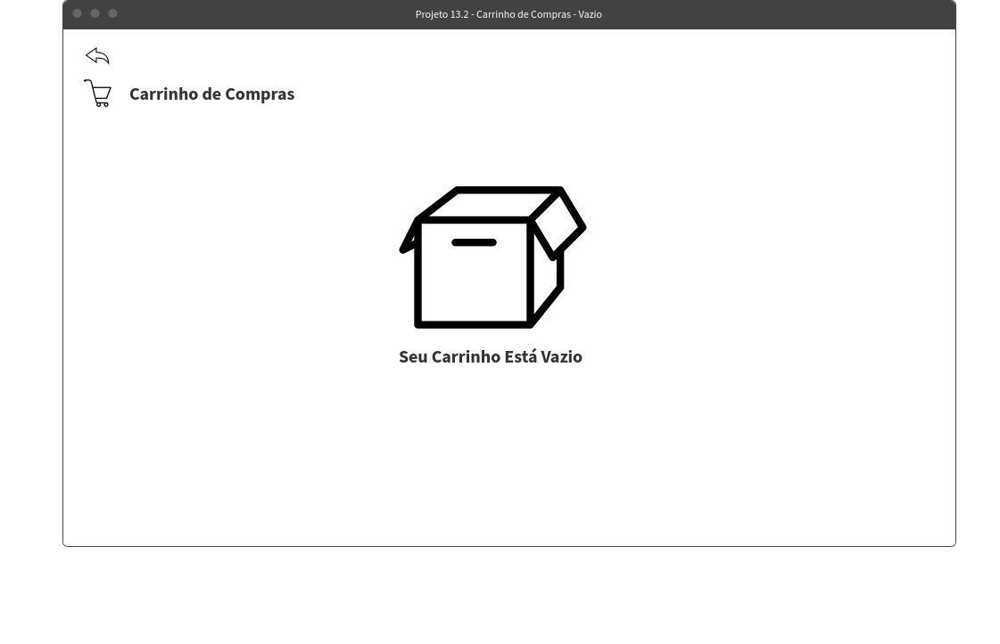

      </details>
    </details>

<details><summary> Na tela principal, crie um elemento que redirecione a pessoa usuária à página do carrinho de compras:</summary>

-   The element must be visible on the home page (product listing);
-   This element should also be present on a product's detail page, but don't worry about that at this point, it will be described in a later requirement;
-   add the attribute`data-testid`with the value`shopping-cart-button`in the element that redirects to the shopping cart page.

    :warning:**Heads up!**O**element**who directs you to the cart page is the one who should contain the`data-testid`. If you do this with a`<Link />`, for example, it is this one who must contain the`data-testid`.

      <details><summary><b>Exemplo da tela principal com o elemento que redireciona para a tela do carrinho:</b></summary>

        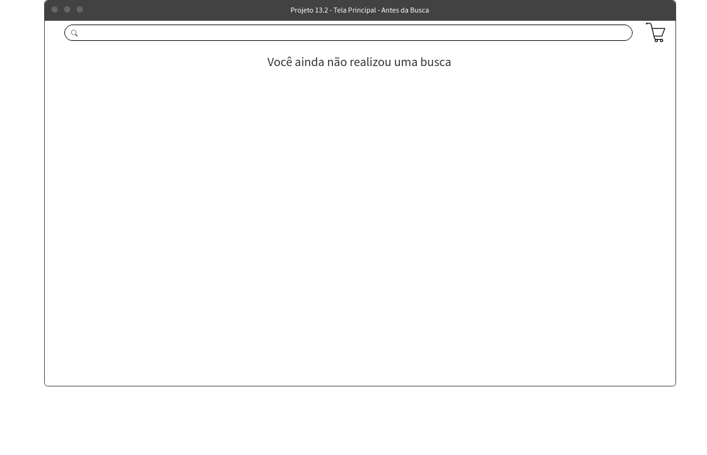

      </details>
    </details><br />

<details>
  <summary><strong>O que será verificado</strong></summary>

-   The home must have the shopping cart button;
-   Clicking the button should take you to the empty cart page, with the message 'Your cart is empty' on it.
    </details>

* * *

## 4. List the product categories available via API on the main page

**PRIORITY 1**

The main screen (product listing) should contain a list of categories, which will be used to filter the search by category. The categories can be obtained through the Mercado Livre API. The request for this API must be made only once, after the screen is loaded.

<details><summary> Na tela principal, liste as categorias obtidas pela API do Mercado Livre:</summary>
  
  * :eyes: **De olho na dica**: Posteriormente as categorias serão utilizadas para realizar novas requisições para listar produtos. Ou seja, elas serão clicáveis para aplicar um filtro de categoria. **Sugerimos a utilização do elemento do tipo `button` ou do tipo `radio button` para listar as categorias. Por hora, neste requisito, será avaliado apenas a listagem das categorias, conforme protótipo.**
  * Adicione o atributo `data-testid` com o valor `category` nos elementos que receberão o nome da categoria. **Atenção!** Caso você opte por utilizar `radio buttons` para realizar a listagem, as `labels` dos elementos que deverão receber o `data-testid`, e não se esqueça da propriedade `htmlFor`.


</details><br />

<details>
  <summary><strong>O que será verificado</strong></summary>
  
  - Exibe as categorias retornadas pela API na página de listagem de produtos.
</details>

* * *

## 5. List products searched for by terms, with summary data associated with those terms

**PRIORITY 1**

The soul of the application is its search logic and product listing. After entering your terms in the`input`from the main screen and click on the search button, a request must be made to the Mercado Livre API, using the typed phrase as parameters. The products returned by the API should be listed on the screen.

<details><summary> Na tela principal, crie a listagem dos produtos recebidos pela API do Mercado Livre ao clicar no botão de busca:</summary>

-   The main screen must have an element`input`with the attribute`data-testid="query-input"`;
-   The main screen must have an element with the attribute`data-testid="query-button"`which, when clicked, triggers the call to the API with the search term searched (that is, with the value entered in the`input`);
-   Render on the screen a summary view of all products returned by the API, containing the name, image and price of each product;
-   add the attribute`data-testid="product"`in the elements that have the data of the products;
-   If the search does not return results, it renders the text on the screen<code>"No products were found"</code>.
    </details><br />

<details><summary>Exemplo da tela principal após uma busca por produtos:</summary>

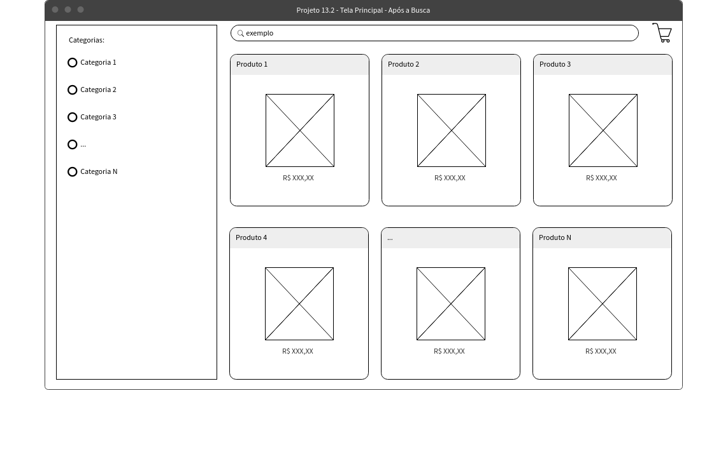

</details>
<details><summary>Exemplo da tela principal caso a busca não retorne resultados:</summary>

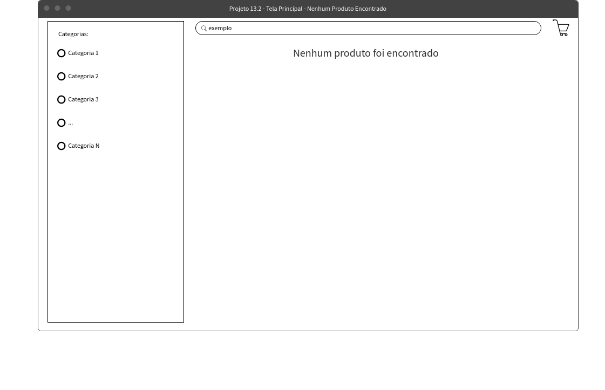

</details><br />

<details>
  <summary><strong>O que será verificado</strong></summary>

-   Displays all products returned by the API, given a given filter.

</details>

* * *

## 6. Select a category and show only products from that category

**PRIORITY 2**

When the user clicks on one of the categories listed on the main screen, the application should list all products found in that category.

<details><summary> Na tela principal, ao clicar em uma das categorias listadas, crie a listagem dos produtos dessa categoria:</summary>

-   By clicking on one of the listed categories, make a request to the Mercado Livre API and render on the screen a summary view of all products returned from that category, containing the name, image and price of each product;
-   add the attribute`data-testid="product"`in the elements that have the data of the products;
-   :eyes:**keeping an eye on the tip**: Remember to query the API endpoints to find the search request by category (more information in[API documentation](#documentação-da-api-do-mercado-livre), in the section**Development**).
    </details><br />

<details>
  <summary><strong>O que será verificado</strong></summary>

-   It correctly displays only the products of the clicked category on the page.
    </details>

* * *

## 7. Redirect to a detailed view screen when clicking on a product's summary view

**PRIORITY 3**

Now that the product listing is created, you will need to create a product detail page.

When clicking on the "card" of a product, the user must be directed to a page containing the name, an image, the price and the technical specification of that product. In addition, this page must have a button that, when clicked, the user must be redirected to the shopping cart page.

<details><summary> Exemplo da tela de detalhes de um produto:</summary>

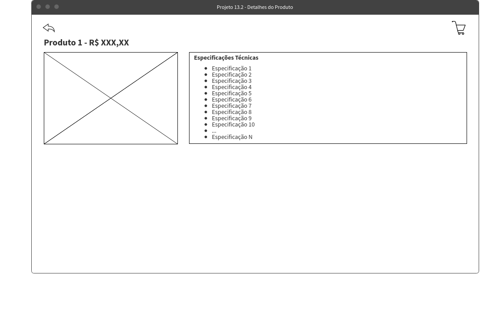

</details><br />

<details><summary> Ao clicar em "um card" de um produto (o elemento com <code>data-testid="product"</code>), a pessoa usuária deve ser redirecionada para uma página contendo os detalhes do produto:</summary>

-   add the attribute`data-testid="product-detail-link"`on the element that, when clicked, will send the user to the product detail page. You must add this attribute for all products;
-   The detail page must have the name, image, price and any other additional information for the product you want;
-   add the attribute`data-testid="product-detail-name"`in the element that, on the details screen, has the name of the product;
-   add the attribute`data-testid="product-detail-image"`in the element that, on the details screen, has the product image;
-   add the attribute`data-testid="product-detail-price"`in the element that, on the details screen, has the price of the product;
-   add the attribute`data-testid="shopping-cart-button"`to the button that, when clicked, redirects to the shopping cart page.
    </details><br />

<details>
  <summary><strong>O que será verificado</strong></summary>

-   Clicking on a product card takes you to the page with its details;
-   Correctly displays the product name, image, and price on its detail page;
-   Displays the button that redirects to the shopping cart page;
-   Clicking the cart button takes you to the shopping cart page with the message 'Your cart is empty' on the screen.
    </details>

* * *

## 8. Add products to cart from product listing screen

**PRIORITY 3**

The user can add a product to the shopping cart from the main page containing the product listing.

All products that have been added to the cart should appear on the Shopping Cart screen.

-   Reminder: When we render the category items, the product data is already inside your application. Think about how to store them without having to make another request.

<details><summary><b>Exemplo da página principal</b></summary>

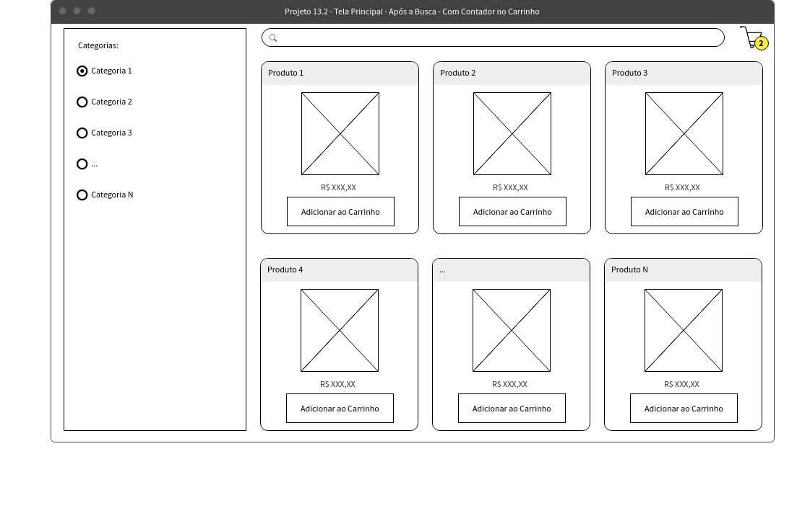

</details><br />

<details><summary> Na tela principal, crie um elemento em cada produto que, ao ser clicado, adiciona o produto ao carrinho de compras:</summary>

-   add the attribute`data-testid="product-add-to-cart"`in the element that performs the action of adding the product to the shopping cart.
    </details>

<details><summary> Na tela do Carrinho de Compras, renderize todos os produtos que foram adicionados ao carrinho:</summary>
  
  * Os produtos na tela do Carrinho de Compras devem possuir o nome, o preço e a quantidade;
  * Adicione o atributo `data-testid="shopping-cart-product-name"` no elemento que possui o nome do produto na tela do carrinho de compras. Você deve adicionar esse atributo para todos os produtos na tela do carrinho;
  * Adicione o atributo `data-testid="shopping-cart-product-quantity"` no elemento que possui a quantidade do produto na tela do carrinho de compras. Você deve adicionar esse atributo para todos os produtos na tela do carrinho.
</details><br />
<details>
  <summary><strong>O que será verificado</strong></summary>

-   Adds a product to the cart from the main screen;
-   When adding a product from the home screen and clicking on the shopping cart, it is expected that no request (fetch) will be made.
    </details>

* * *

## 9. Add a product to the cart from its detailed view screen

**PRIORITY 3**

From the details screen of a product, it should be possible to add it to the shopping cart.

<details><summary> Na tela de detalhes de um produto, crie um elemento que adicione o produto ao carrinho:</summary>

-   add the attribute`data-testid="product-detail-add-to-cart"`in the element that has the action of adding the product to the shopping cart.

-   Still in the details screen of a product, add an element that, when clicked, redirects the user to the cart screen. This element must have the attribute`data-testid="shopping-cart-button"`.
    </details>
    <details><summary> Na tela do carrinho de compras, renderize todos os produtos adicionados ao carrinho:</summary>

-   The products on the Shopping Cart screen must have the name, price and quantity;

-   add the attribute`data-testid="shopping-cart-product-name"`in the element that has the product name on the shopping cart screen. You must add this attribute for all products in the cart screen;

-   add the attribute`data-testid="shopping-cart-product-quantity"`in the element that has the product quantity on the shopping cart screen. You must add this attribute for all products in the cart screen.
    </details><br />
    <details>
      <summary><strong>O que será verificado</strong></summary>


-   Adds a product to the cart from its details screen;
-   Evaluates whether the name and quantity of the added product are displayed correctly on the shopping cart screen.
    </details>

* * *

## 10. View the list of products added to the cart on your page and allow manipulation of their quantity

**PRIORITY 3**

On the Shopping Cart screen, it must be possible to increase and/or decrease the quantity of the product. It must also be possible to delete a product from the cart.

<details><summary> Exemplo da tela do carrinho de compras:</summary>

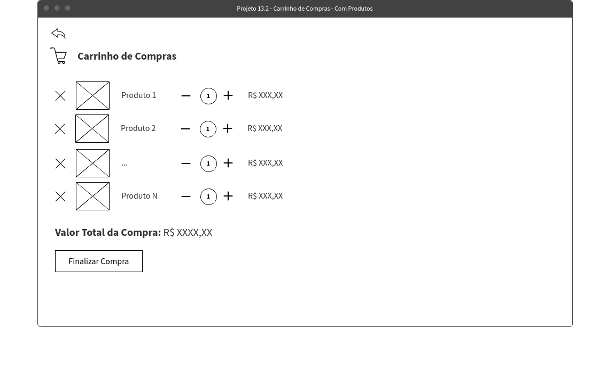

</details><br />

<details><summary> Na página do carrinho de compras, crie dois elementos para cada produto que, ao serem clicados, diminuem ou aumentam a quantidade desse produto presente no carrinho:</summary>

-   Add elements on the shopping cart page to increase or decrease the quantity of each product present in the cart;
-   The minimum quantity of a product in the cart must be`1`;
-   add the attribute`data-testid="product-increase-quantity"`in the element that increases the quantity of a product. Add this attribute for all products;
-   add the attribute`data-testid="product-decrease-quantity"`in the element that decreases the quantity of a product. Add this attribute for all products;
-   You can create an element to remove an item from the cart, but this will not be evaluated at this time.
    </details><br />

<details>
  <summary><strong>O que será verificado</strong></summary>

-   Adds products to the cart and manipulates their quantities.
    </details>

* * *

## 11. Rate and comment on a product on its detailed display screen

**PRIORITY 3**

On the details screen of a product, there must be a form to add reviews about it. This form must contain a field for the e-mail of the evaluator, a score between 1 and 5 and a field for comments about the product. Furthermore, the fields`e-mail`e`nota`must be mandatory and the email must be valid (example:`teste@trybe.com`).

The list of evaluations already carried out must persist on the product details screen in case the user leaves and returns later.

<details><summary><b> Exemplo da tela de detalhes contendo o formulário para adicionar avaliações:</b></summary>


</details>
<details><summary><b> Exemplo da tela de detalhes contendo avaliações:</b></summary>

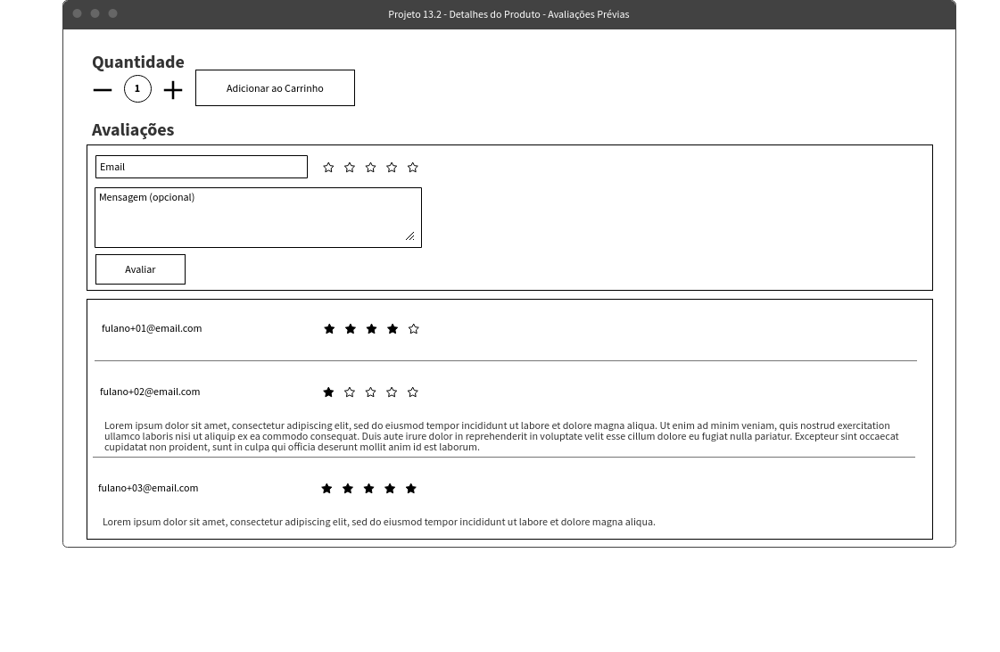

</details><br />

<details><summary> Na tela de detalhes de um produto, crie um formulário para adicionar avaliações:</summary>

-   create a`input`with the attribute`data-testid="product-detail-email"`, where the user will put the email;
-   Create 5 elements containing the attribute`data-testid="${index}-rating"`, as`${index}`going from 1 to 5, for the person to choose which rating to give the product.**In this form, the 5 elements need to be rendered on the screen, regardless of the grade assigned by the evaluator**;
-   Add a text field with the attribute`data-testid="product-detail-evaluation"`for the user to write something about the product;
-   Add a button with the attribute`data-testid="submit-review-btn"`for the user to submit the assessment.
    </details>

<details><summary> Renderize as avaliações criadas a partir do formulário:</summary>

-   By clicking on the button with the attribute`data-testid="submit-review-btn"`, the information entered in the form should be rendered on the product details screen below the form and the text fields of the form should be cleared;
-   Reviews must persist on the product details screen. That is, if the user leaves the screen and logs in again, the ratings should still be rendering on the page.
    </details><br />
    <details>
      <summary><strong>O que será verificado</strong></summary>


-   Evaluates whether it is possible to perform an evaluation on the details screen of a product;
-   Evaluates if the form is validated correctly;
-   Evaluates whether the form text fields are cleared after the evaluation is submitted;
-   Evaluates whether the review continues after reloading the product detail page;
-   Evaluates whether the review made for a specific product does not appear on the detail screen of another product.
    </details>

* * *

## 12. Finalize the purchase by viewing a summary of the purchase, filling in your details and choosing the payment method

**PRIORITY 4**

Create a checkout screen, which must be accessed from the Shopping Cart screen. The screen should contain a form to add shopper information and a summary of the products that have been added to the cart. After completing the purchase, if the form is validated, the cart must be emptied and the user must be redirected to the main screen (product listing).

<details><summary><b> Exemplo de processo completo da finalização:</b></summary>

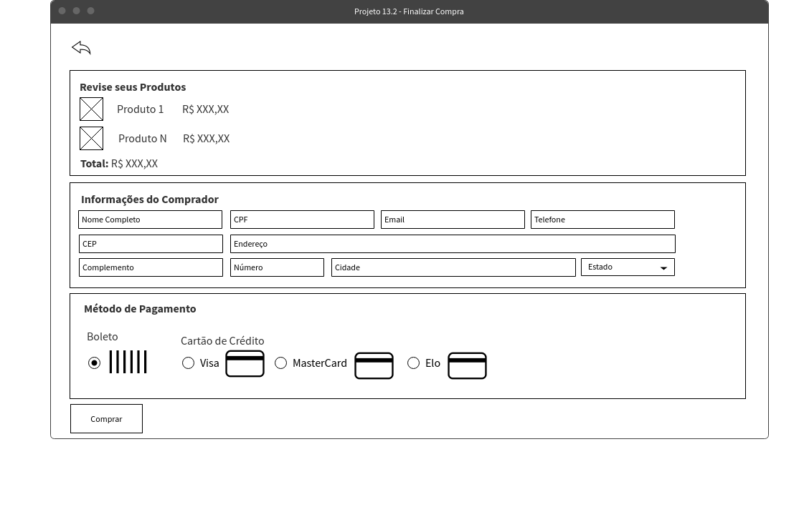

</details><br />

<details><summary> Na tela do carrinho de compras, crie um elemento para finalizar a compra:</summary>
  
  * Este elemento, ao ser clicado, deve redirecionar a pessoa usuária à página de _checkout_;
  * Adicione o atributo `data-testid="checkout-products"` no elemento que leva a pessoa à página de _checkout_.
</details>

<details><summary> Na tela de <i>checkout</i>, mostre um resumo dos produtos adicionados ao carrinho</summary>

-   When accessing the checkout screen, the name of the products in the cart must be on the screen. You can add any other information about the products, but only the**Name**is required.
    </details>

<details><summary> Na tela de <i>checkout</i>, crie um formulário para a pessoa usuária adicionar os seus dados pessoais:</summary>

-   <details><summary> O formulário precisa possuir os seguintes campos:</summary>

    -   Full Name: this element must have the attribute`data-testid="checkout-fullname"`;
    -   Email: this element must have the attribute`data-testid="checkout-email"`;
    -   CPF: this element must have the attribute`data-testid="checkout-cpf"`;
    -   Phone: this element must have the attribute`data-testid="checkout-phone"`;
    -   CEP: this element must have the attribute`data-testid="checkout-cep"`;
    -   Address: this element must have the attribute`data-testid="checkout-address"`.
    -   <details><summary> Método de pagamento: este elemento deve ser um <code>input</code> do tipo <code>radio</code> e conter 4 opções:</summary>

        -   Boleto, which must have the attribute`data-testid="ticket-payment"`;
        -   Visa, which must have the attribute`data-testid="visa-payment"`;
        -   MasterCard, which must have the attribute`data-testid="master-payment"`;
        -   Link, which must have the attribute`data-testid="elo-payment"`;
            </details>
    -   A button to submit the form, containing the attribute`data-testid="checkout-btn"`
        </details>
-   All form fields are mandatory and need to be filled in to complete the checkout;
    </details>

<details><summary> Ao clicar no botão para submeter o formulário:</summary>
  
  - Caso algum campo não esteja preenchido, um elemento contendo a mensagem `Campos inválidos` deve ser renderizado. Este elemento deve possuir o atributo `data-testid="error-msg"`;
  - Caso todos os campos estejam preenchidos, a pessoa usuária deve ser redirecionada para a tela principal (listagem de produtos) e o carrinho deve ser esvaziado. :bulb: Ou seja, caso a pessoa usuária acesse a página do carrinho de compras após finalizar o checkout, a mensagem `Seu carrinho está vazio` deverá estar na tela.
</details><br />

<details>
  <summary><strong>O que será verificado</strong></summary>

-   Evaluates whether it is possible, from a shopping cart with products, to access the checkout page with a valid form.
    </details>

* * *

# Bonus Requirements

## 13. Show next to the cart icon the amount of products inside it, in all the screens where it appears

**PRIORITY 4**

Add next to the element that redirects to the shopping cart page, a number containing the total amount of items stored in the cart. This number must appear on all pages where this element is present.

<details><summary><b> Exemplo da tela principal com a quantidade junto ao carrinho</b></summary>


</details><br />

<details><summary> Adicione a quantidade de produtos armazenados no carrinho:</summary>

-   This element must be visible from both the product listing page and the product detail page;
-   add the attribute`data-testid="shopping-cart-size"`in the element that contains the amount of products present in the cart;
-   The quantity to be displayed is the total number of items, that is, if the person adds productA 5 times and productB 2 times, the value to be displayed is 7.
    </details><br />
    <details>
      <summary><strong>O que será verificado</strong></summary>


-   Evaluates whether the amount of products in the product listing screen's cart is rendered correctly;
-   When reloading the listing page and adding new products, it evaluates whether the quantity of items in the shopping cart is updated in the details screen.
    </details>

* * *

## 14. Limit the amount of products added to the cart by the amount available in stock

**PRIORITY 4**-

Already**shopping cart screen**it is now possible to increase or decrease the quantity of products. Now you must limit the maximum amount that the user can add to the cart according to the available stock quantity of each product.

<details><summary> Na <strong>tela do carrinho de compras</strong>, crie um limite para a quantidade máxima dos produtos: </summary>

-   When clicking on the element that has the attribute`data-testid="product-increase-quantity"`to increase the quantity of a product in the cart, the value cannot exceed its available quantity in stock;
-   :eyes:**Tip**: You can find this value in the key`"available_quantity"`, available on the Mercado Livre API.
    </details><br />

<details>
  <summary><strong>O que será verificado</strong></summary>

-   Evaluates if it is not possible to add more products to the cart than available in stock;
-   When trying to add more products to the cart than what is available in stock, the value must not be changed.
    </details>

* * *

## 15. Show which products have free shipping

**PRIORITY 4**

Some products have free shipping. Add this information to these products, either on the product listing screen or on a product's detail screen.

<details><summary><b> Exemplo da tela de listagem dos produtos, informando quais produtos possuem frete grátis:</b></summary>

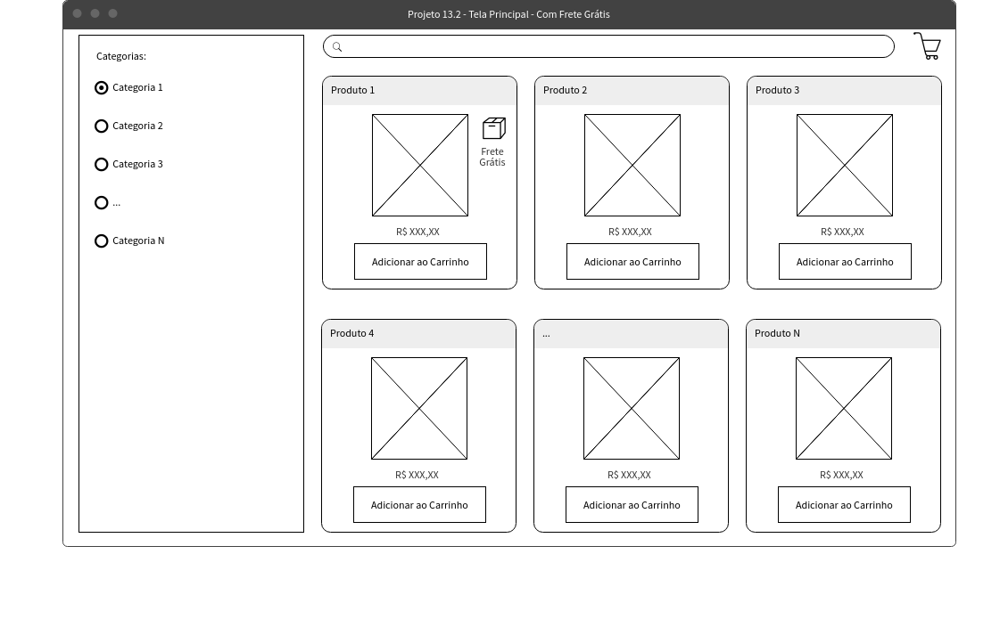

</details>

<details><summary><b> Exemplo da tela de detalhes de um produto, informando que possui frete grátis:</b></summary>

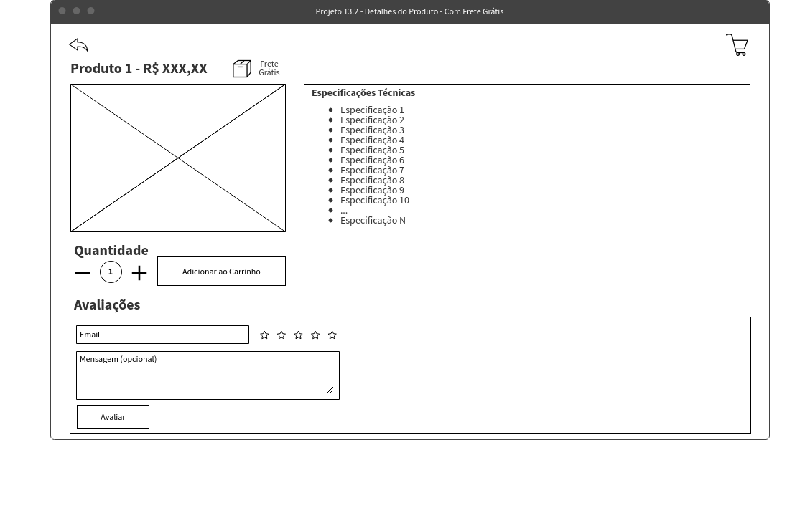

</details><br />

<details><summary> Adicione a informação de frete grátis aos produtos que o possuem:</summary>

-   Add an element that shows this information for each product that has free shipping on the product listing screen;
-   This information can also be added to the product details screen, but this will not be evaluated;
-   add the attribute`data-testid="free-shipping"`in the element that displays this information for all products that have free shipping;
-   For products that do not have free shipping, you do not need to add any new elements.
    </details><br />
    <details>
      <summary><strong>O que será verificado</strong></summary>


-   Correctly displays free shipping information for products.
    </details>

* * *

# non-evaluative requirements

## 16. Make a layout for the site

**PRIORITY 5**

Add a nice layout to the site for users to have a good experience.

* * *

## 17. Make a responsive layout for the site

**PRIORITY 5**

Make a full responsive layout, for small screens.

* * *

## 18. Create a dropdown selector to sort the product list by highest and lowest price

**PRIORITY 5**

Create a dropdown selector that allows the product list to be sorted by highest and lowest price.

<details><summary> Exemplo de ordenação de produtos por preço</summary>

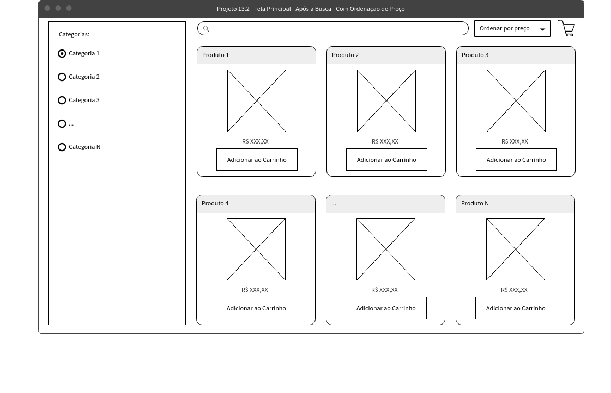

</details>

* * *

## 19. Put an animation in the cart for when a product is added

**PRIORITY 5**

Place an animation in the cart when adding/removing a product.

* * *

## 20. Create a side slider to display the cart on the main screen

**PRIORITY 5**

Display cart content in a slider on the side of the screen, so that it can be displayed and hidden via button interaction (see card details).

<details><summary> Exemplo da listagem com carrinho populado</summary>

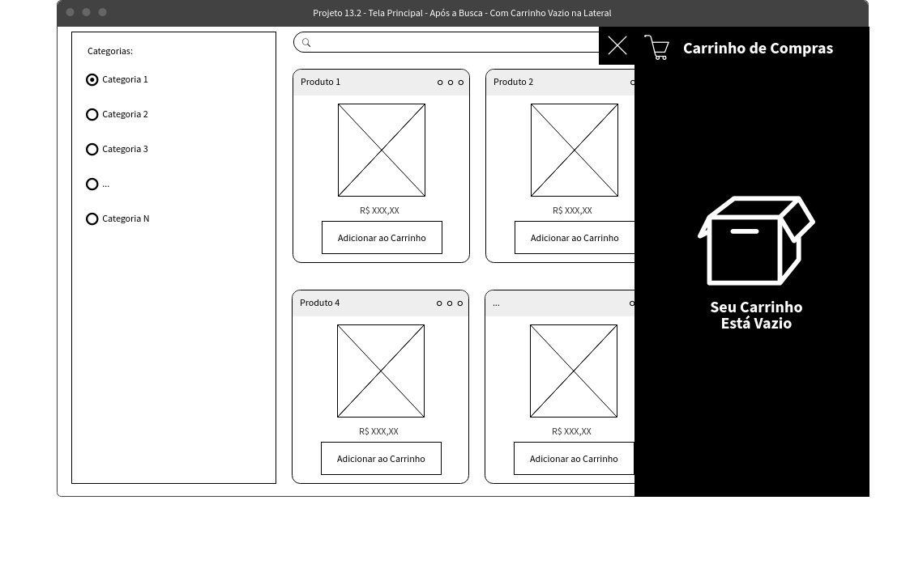

</details>

<details><summary> Exemplo da listagem com carrinho vazio</summary>


</details>

* * *

## 21. On the main screen, highlight the products already added to the cart

**PRIORITY 5**

Highlight the products that have already been added to the cart, distinguishing them from the other products in the list on the main page (see details in the card below).

<details><summary> Exemplo da listagem com destaque</summary>
  
  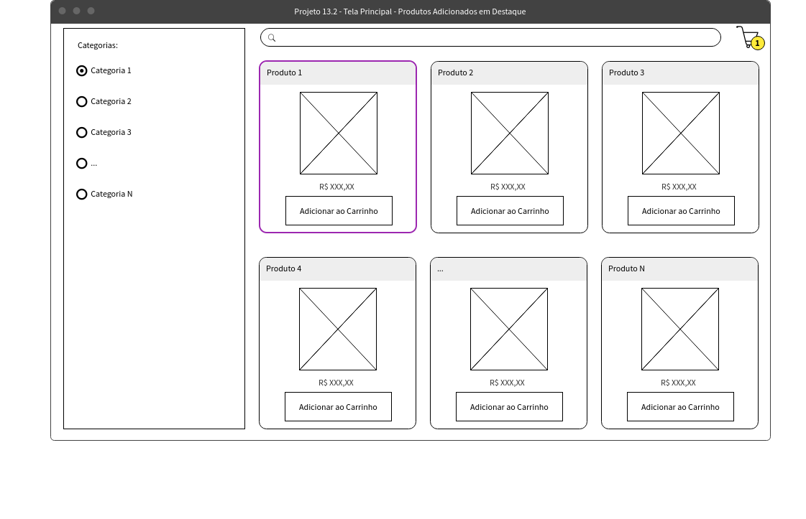
</details>

* * *
